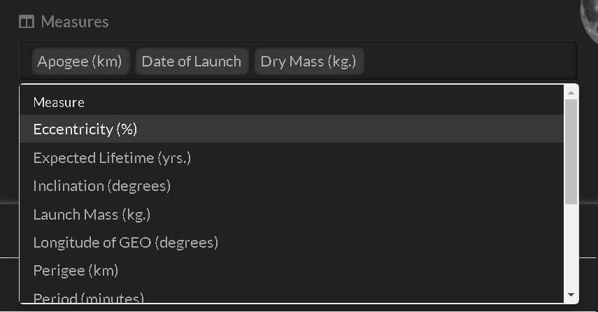

# Satellites Guide

Satellites is an interactive table app for analysing satellites that are currently orbiting the Earth.

Data is sourced from the Union of Concerned Scientists (UCS) [UCS Satellite Database](https://www.ucsusa.org/resources/satellite-database)

## Features

- View aggregated statistics (summary)

- View individual records (details)

- Add and reorder columns

- Filter by double clicking

- Add cell bars

- Animate measure range

- Change the measure statistic

- Save all the above in up to eight custom views

## Control panel

Choosing the view, selecting columns, filtering and more is done with the control panel. If hidden, use the 'sun' switch to reveal (it is left of the eight 'planet' icon buttons).

## Table columns

The table has three types of columns:

- **Identifiers** are unique to each satellite
- **Factors** are words common to multiple satellites
- **Measures** are numbers and dates

Columns of the same type are positioned together in this order: Identifiers | Factors | Measures

## Views

**Summary** factor columns are on the left and aggregated measures are on the right side of the table.

**Details** identifier columns on the left, followed by factors and then measures on the right side of the table.

The summary view does not contain identifiers. The details view does not contain the count column.

## Show controls and save changes

The 'sun' switch hides/shows the concealable controls.

Eight circles (the 'planets') store eight sets of table views including summary/details selection, selected columns, filters, measure statistic and cell bar choices.

Saving is automatic, click the little circles to move between configurations.

## Select

Identifiers can only be seen in the 'Details' view. At least one factor is always shown. Measure columns are optional.

### Identifiers

To select identifier columns, click on '...more' to reveal additional controls.

Click insider the Identifiers selector and select the identifier columns you want added to the table.

Drag and drop the selected identifiers to reorder the columns in the table.

### Factors

Selecting factors is similar to identifiers, and columns can be reordered with drag and drop too.

There are many factors to choose so scroll down and you'll find convenience commands that select all, inverse and clear the selection.

Clearing will leave one factor remaining - it is a requirement of the table.

### Measures

Measures are selected similar to factors, columns reordered with drag and drop and convenience commands when you scroll down.

_Bonus feature_:
When a selected measure is double clicked, it replaces the measure in the slider.

## Filter

### Different factors

### Same factor

### Measures

## Choose a statistic

## Sort

## Column descriptions

## Cell bars
